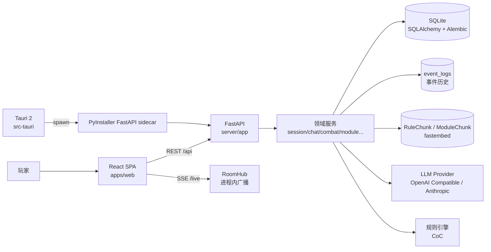
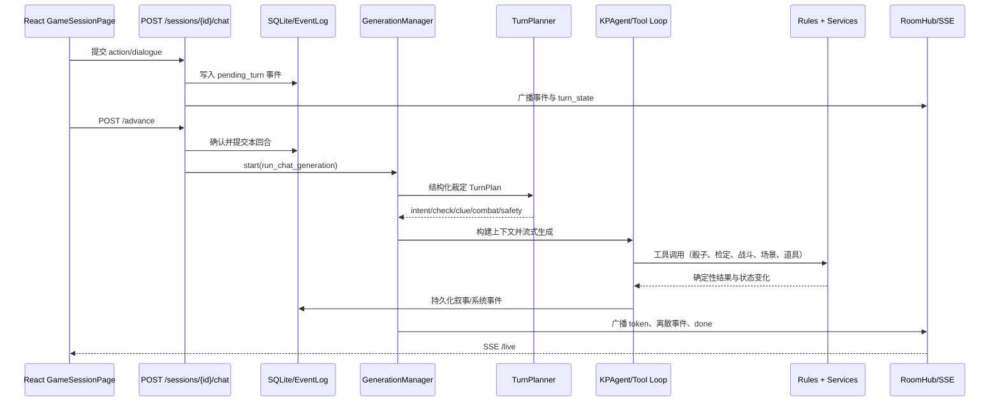

# TRPG Player 现状架构与架构评审

> 文档版本：v1.0
> 梳理日期：2026-07-19
> 适用范围：当前仓库代码、配置、测试、打包文档；不把设计稿中的规划能力当作已实现能力。

本次梳理同时参考了代码知识图谱与仓库文件：当前项目索引约含 6,325 个节点、23,459 条关系，识别出 78 个路由节点；关键规模指标以源码行数为准，避免把图谱中的测试/fixture 节点误当成生产代码。

## 1. 一页结论

TRPG Player 当前是一个**桌面优先、单体后端、事件驱动交互、AI 增强规则执行**的 TRPG 应用：

- 前端是 React 19 + TypeScript + Vite 的 SPA，通过 REST 与 SSE 和后端通信。
- 后端是 FastAPI + SQLAlchemy + Alembic 的 Python 单体，按 API、服务、AI、规则、模型、Schema 分层。
- 数据默认落在 SQLite；会话事件使用 `event_logs` 记录，实时输出使用进程内 `RoomHub` 广播。
- AI 不是直接修改世界状态，而是通过 TurnPlan、KP Agent、工具执行器和确定性规则服务间接推进状态。
- 桌面模式由 Tauri 2 启动 PyInstaller 打包的 FastAPI sidecar，并由后端同源托管前端静态资源。

从架构设计角度看，当前方案适合“单机游玩 + 可信局域网联机 + 快速迭代”，不适合直接演进为公网 SaaS。最大的结构性问题不是技术栈选错，而是**单体内部的职责边界、共享状态并发模型、实时层持久化策略、前后端契约治理尚未形成稳定的架构约束**。

建议优先级：

1. 先补齐信任边界和数据并发约束，避免继续扩大安全与一致性风险。
2. 再把生成编排、战斗状态机、世界状态写入从超大服务文件中拆出稳定端口。
3. 最后再考虑 Redis/任务队列/独立服务等扩展，不建议当前阶段直接微服务化。

## 2. 架构画像

### 2.1 架构风格

当前系统可以归类为：

> **模块化单体（Modular Monolith） + 事件日志（Event Log） + 进程内实时广播（In-process Pub/Sub） + AI 编排管线（AI Orchestration Pipeline） + 桌面 sidecar 部署**

它同时包含四种运行形态：

| 形态 | 前端 | 后端 | 适用场景 |
|---|---|---|---|
| 开发模式 | Vite `5173` | Uvicorn/FastAPI `8000` | 本地开发、调试 |
| 单机源码运行 | Vite 或后端静态托管 | Python 进程 + SQLite | 开发测试 |
| Tauri 桌面模式 | Tauri 窗口 | Rust 启动 PyInstaller sidecar，FastAPI 同源托管 SPA | 首选游玩方式 |
| 局域网客人模式 | 客户端 SPA | 客户端通过 `server_url` 访问房主 FastAPI | 可信局域网多人 |

### 2.2 部署拓扑



桌面启动链路由 `src-tauri/src/lib.rs` 实现：启动 sidecar、读取 `TRPG_BACKEND_PORT`、等待后端健康检查，退出时杀掉子进程。后端在 `server/app/main.py` 中按需挂载 `apps/web/dist`，因此桌面模式是“一个窗口 + 一个本地服务进程”，不是把业务逻辑放进 Rust。

## 3. 代码框架

### 3.1 顶层目录与职责

```text
apps/web/              React/Vite 前端 SPA
apps/web/src/api/      OpenAPI 导出的 REST TypeScript 类型
server/app/api/        FastAPI 路由与请求编排
server/app/services/   会话、聊天、战斗、模组、RAG、房间等业务服务
server/app/ai/         LLM provider、上下文、planner、agent、工具、摘要
server/app/rules/      规则系统抽象与 CoC 确定性规则实现
server/app/models/     SQLAlchemy ORM 模型
server/app/schemas/    Pydantic 请求/响应模型
server/alembic/        数据库迁移
server/tests/          后端单元测试、API 测试、状态机测试
server/evals/          需要 fixture/模型评估的叙事与指令评测
src-tauri/             Tauri 2 桌面外壳与 sidecar 管理
loader/                桌面启动加载页
docs/                  设计、路线图、打包和架构文档
```

### 3.2 后端模块边界

| 模块 | 主要文件 | 当前职责 |
|---|---|---|
| 应用入口 | `server/app/main.py` | FastAPI 生命周期、迁移、CORS、健康检查、SPA 静态托管 |
| API 层 | `server/app/api/*.py` | 路由、参数校验、权限调用、触发异步生成 |
| 会话域 | `session_service.py`、`models/session*.py` | 会话、席位、房主、事件分页、回合确认、场景位置 |
| 聊天/生成域 | `chat_service.py` | 玩家行动、OOC、回合推进、KP 生成、文本指令、工具执行、持久化、收尾 |
| 战斗/追逐域 | `combat_service.py`、`chase_service.py`、`rules/coc/combat.py` | 战斗/追逐状态机与规则结算 |
| 模组/规则书域 | `module_service.py`、`rulebook_service.py`、`module_rag_service.py` | 上传、解析、结构化模组、规则书切块与 RAG |
| AI 域 | `ai/context.py`、`ai/turn_planner.py`、`ai/agents/*` | 上下文构建、结构化裁定、叙事、NPC/队友/幕后代理 |
| 状态记忆域 | `world_state.py`、`world_memory.py` | `GameSession.world_state` 的读写、线索、NPC 记忆、剧情标志 |
| 实时域 | `room_hub.py`、`generation_manager.py` | SSE 订阅、房间广播、单房间生成锁、in-flight 缓冲 |
| 数据访问 | `database.py`、`models/*`、`alembic/*` | SQLite 连接、WAL、迁移、备份、种子初始化 |
| 规则引擎 | `rules/base.py`、`rules/registry.py`、`rules/coc/*` | 规则系统注册、角色计算、检定、战斗规则 |

### 3.3 前端模块边界

| 模块 | 主要文件 | 当前职责 |
|---|---|---|
| 路由壳 | `apps/web/src/App.tsx`、`components/layout/*` | SPA 路由、布局、错误边界、全局提示 |
| API 客户端 | `apps/web/src/api/client.ts` | API base、`X-Player-Token`、JSON 请求、上传、SSE 解析 |
| 页面 | `pages/*.tsx` | 首页、模组、规则书、角色、游戏、房间、设置 |
| 游戏域组件 | `components/game/*` | 聊天、掷骰、战斗、追逐、调查板、战报、成长 |
| 角色域组件 | `components/character/*` | CoC 车卡、装备、技能、角色编辑 |
| 状态 | `stores/sessionStore.ts`、`stores/moduleStore.ts` | 会话列表、当前会话、事件消息、流式消息、模组列表 |
| 特性模块 | `features/onboarding/*`、`features/characters/*`、`features/game-setup/*` | 引导、角色列表、建房/入房流程 |
| UI 基础设施 | `components/ui/*`、`index.css` | Radix UI 封装、主题、弹窗、提示、基础样式 |

前端目前存在明显的页面级大组件：`GameSessionPage.tsx` 约 1,930 行、`CharacterPage.tsx` 约 1,495 行、`SettingsPage.tsx` 约 1,217 行。它们承担了较多 API 调用、交互状态和视图拼装职责。

## 4. 数据与领域模型

### 4.1 核心持久化模型

| 模型 | 存储内容 | 架构角色 |
|---|---|---|
| `Module` | 模组描述、场景、NPC、线索、手书、真相、RAG 状态 | 可复用剧本定义 |
| `Character` | 角色属性、技能、规则系统、背景、状态、owner token | 玩家/AI 角色资产 |
| `GameSession` | 模组引用、状态、主角快捷字段、当前场景、`world_state`、`turn_state` | 一局游戏的聚合根候选 |
| `SessionParticipant` | 会话席位、真人/AI、认领 token、准备态 | 多人房间席位事实来源 |
| `EventLog` | 有序事件、角色、可见性、元数据、摘要 | 会话事件日志与重放来源 |
| `Rulebook` / `RuleChunk` | 规则书元数据、页码、向量切块 | 规则 RAG |
| `ModuleChunk` | 模组原文切块、场景提示、向量 | 模组 RAG |

### 4.2 会话状态的实际分布

会话状态不是单一来源，而是分散在三处：

1. 结构化列：`status`、`room_code`、`player_character_id`、`current_scene_id`。
2. JSON 列：`world_state`、`turn_state`。
3. 事件日志：`event_logs`，保存玩家输入、叙事、骰子、系统、OOC 等事件。

`world_state` 当前包含或承载了战斗、追逐、已访问场景、角色位置、剧情 flags、线索台账、NPC 记忆、幕后游标、滚动摘要、RAG 统计、token 用量、战报等多类状态。`server/app/services/world_state.py` 已提供深拷贝读写适配器，并定义了 `SCHEMA_VERSION = 1`，但代码库仍存在大量直接 `dict(session.world_state)` 与整段回写的旧调用点。

这说明 `GameSession` 实际上承担了“会话聚合根 + 多个子系统状态仓库 + 运行统计仓库”三种角色。

## 5. 关键运行链路

### 5.1 玩家行动到 AI 叙事



具体入口：

- `server/app/api/chat.py:62` 接收正式行动，先写入带 `pending_turn` 的事件。
- `server/app/api/chat.py:228` 的 `/advance` 在真人都确认后触发 `run_chat_generation`。
- `server/app/services/chat_service.py:2568` 的 `_run_generation` 负责规划、上下文、分头行动、工具循环、校验与落库。
- `server/app/ai/turn_planner.py` 负责低温结构化裁定。
- `server/app/ai/agents/kp_agent.py` 负责 KP 流式叙事，并在检定轮做输出约束。
- `server/app/services/room_hub.py:59` 将实时 chunk 广播给所有 SSE 订阅者。
- `server/app/api/sessions.py:519` 的 `/live` 提供常驻 SSE；离散事件的可靠恢复依赖历史接口与事件 id 去重。

### 5.2 AI 生成管线

当前 AI 生成已经不是“一个 prompt + 一个 completion”，而是三段式增强管线：

```text
玩家回合
  -> TurnPlan（低温结构化 JSON）
  -> KP 上下文（角色/场景/事件/世界记忆/RAG/规则书）
  -> KPAgent 工具循环或文本指令兼容路径
  -> TurnValidator（必要时校验/改写落库版本）
  -> 确定性状态守卫（战斗、SAN、HP、场景、道具等）
  -> EventLog + world_state + SSE
```

该设计的优点是把“语义判断”和“规则执行”分开：LLM 提出意图，规则引擎和服务负责最终结算。代价是编排逻辑高度集中在 `chat_service.py`，AI、状态、广播、数据库事务互相穿透。

### 5.3 桌面启动链路

```text
Tauri 窗口
  -> spawn resources/trpg-server/trpg-server
  -> sidecar 选择 8756 或随机空闲端口
  -> stdout 打印 TRPG_BACKEND_PORT <port>
  -> loader 轮询 /api/health
  -> 窗口跳转到 http://127.0.0.1:<port>
  -> FastAPI 同源托管 web_dist + /api + /live
```

数据目录在打包模式下切换到系统用户目录，并在迁移前做 SQLite 备份；这是当前部署设计中较成熟的一部分。

## 6. API、实时与契约现状

### 6.1 HTTP API 分组

当前后端路由主要分为：

| 分组 | 示例 |
|---|---|
| 角色与规则 | `/api/characters`、`/api/rules/{rule_system}/*` |
| 模组 | `/api/modules`、上传、RAG rebuild |
| 规则书 | `/api/rulebooks`、搜索、上传、删除 |
| 会话/大厅 | `/api/sessions`、认领席位、准备、开始、踢人 |
| 游戏回合 | `/api/sessions/{id}/chat`、`advance`、`check`、`roll`、`travel` |
| 战斗/追逐/道具 | `/api/sessions/{id}/combat/*`、`chase/*`、`inventory/*` |
| AI 设置 | `/api/settings/ai/*` |
| 实时 | `/api/sessions/{id}/live`（SSE） |

### 6.2 前后端契约问题

历史上的 `packages/shared` 没有任何业务导入，且其 camelCase 类型与后端 snake_case Schema 已经漂移；本次已删除该包，REST 契约改由 `server/openapi.json` 和 `apps/web/src/api/generated.ts` 维护。当前生成类型覆盖 REST 基线，SSE、流式 chunk、动态 metadata 和未声明 `response_model` 的匿名响应仍保留手写协议。

## 7. 已有设计优点

1. **桌面优先定位清晰**：SQLite、本地素材目录、Tauri sidecar、种子初始化和迁移备份形成了完整的单机闭环。
2. **确定性规则与 AI 解耦方向正确**：`RuleEngine`、CoC 规则实现、工具执行器和状态守卫避免让自然语言直接改规则状态。
3. **事件日志适合重连与回放**：事件有 `sequence_num`、可见性与元数据，前端支持历史分页和 SSE 去重。
4. **AI 质量控制有工程化意识**：TurnPlan、TurnValidator、上下文预算、滚动摘要、RAG 统计、usage 追踪和 evals 都已经落地。
5. **发布链路考虑了数据安全**：打包模式使用用户可写目录，迁移前自动备份，迁移失败进入维护模式。
6. **测试和 CI 已接入主流程**：后端 pytest/ruff/evals、前端 tsc/build/oxlint、gitleaks 都在 `.github/workflows/ci.yml` 中执行。

## 8. 架构不足与风险评审

以下按“对系统性演进的影响”排序，而不是按代码风格排序。

本轮已完成的架构基线修正：

- `event_logs(session_id, sequence_num)` 已增加数据库唯一约束，迁移会先检查历史重复值，写入冲突会回滚重试，回合重排使用临时序号区间。
- 会话级读权限已收敛到 `require_session_viewer()` / `can_view_session()`，覆盖历史、搜索、地点、战报、成长、库存、战斗、追逐和 SSE；setup 阶段仍保留空席大厅的受控访客例外。
- 核心写权限已收敛到 `require_session_actor()`、`require_session_token_actor()` 和 `require_session_manager()`；战斗/追逐不再在错误 token 下回退主角，成长结算、战报生成和开场重试会在副作用前校验真人席位。
- REST 契约已由 `server/openapi.json` 和生成的 `apps/web/src/api/generated.ts` 维护，未使用且已漂移的 `packages/shared` 已删除。

### P0：必须先控制的风险

| 问题 | 证据 | 影响 | 建议 |
|---|---|---|---|
| 信任边界仍是 MVP 级别 | `server/app/api/deps.py` 只读取 `X-Player-Token`；前端 token 存 `localStorage`；`main.py:58-65` 为 `allow_origins=["*"]`；README 明确不支持公网 | token 可复制，跨网传输无 TLS，CORS 与权限模型不适合不可信网络 | 明确部署边界；近期统一强制 token/房主/席位校验；后续增加账号、签名会话、TLS 终止、限流和审计日志 |
| 实时与生成状态只存在进程内 | `RoomHub` 使用 `dict[str, list[asyncio.Queue]]`；`GenerationManager` 使用 `dict[str, asyncio.Task]` | 重启丢失连接和进行中的生成；多进程/多副本时广播与锁失效 | 当前阶段保持单进程并在文档中固化；若要扩展，使用 Redis Pub/Sub + 持久任务状态 + 外部队列 |

### P1：会阻碍持续演进的问题

| 问题 | 证据 | 影响 | 建议 |
|---|---|---|---|
| `chat_service.py` 是事实上的“上帝模块” | 约 5,042 行，包含输入解析、AI 编排、工具执行、规则补偿、事件持久化、广播、RAG、后台收尾等职责；首批事件顺序逻辑已提取到 `turn_event_order.py` | 修改一个规则或提示链路容易影响实时、数据库和其他回合入口；难以建立稳定测试边界 | 按《chat_service 增量拆分纪律》逐簇拆为 `turn_orchestrator`、`narration_pipeline`、`tool_executor`、`event_writer`、`generation_hooks`；先保持同一进程和同一数据库 |
| 会话服务边界过宽 | `session_service.py` 约 1,171 行，同时处理席位、权限、事件、场景图、回合确认、世界状态写入 | 领域模型、授权策略和持久化细节相互耦合 | 把“房间/席位”“事件仓库”“场景导航”“授权策略”拆为独立模块，统一由 application service 编排 |
| `world_state` 过度承载异构状态 | `GameSession.world_state` JSON 同时存战斗、剧情、记忆、统计、战报等；适配器文档也承认旧调用点仍未迁移 | 难以校验、查询、迁移和做并发合并；任意键名变化都可能成为隐性兼容问题 | 将战斗、追逐、回合、用量、RAG 统计等高频/强一致状态拆成表；剧情记忆保留 JSON，但建立 Pydantic schema 与版本迁移 |
| 少量大厅/投票写授权仍由领域函数各自处理 | 聊天、战斗、追逐、库存、成长、战报、开场和管理入口已使用统一依赖；`start_game`、`kick_seat`、结束投票等仍在服务函数内部解释 host/actor 规则 | 授权基线已形成，但新增大厅用例仍可能绕开统一入口或产生不同错误语义 | 下一步把 lobby/vote 的 host/actor 策略也迁入统一授权端口，并让领域服务只处理业务不变量 |
| REST 契约已统一但强类型覆盖不完整 | OpenAPI 已生成；部分接口仍返回裸 `dict`、动态 metadata，`/live` 是手写 SSE | 生成类型不能覆盖匿名响应和流式协议，前端仍需手写协议 DTO | 为稳定 REST 响应补充 Pydantic `response_model`；为 SSE 定义版本、事件 id、generation id 和游标语义 |
| 页面和状态容器过大 | `GameSessionPage.tsx`、`CharacterPage.tsx`、`SettingsPage.tsx` 均超过千行 | UI 变更、API 调整、状态回放和测试耦合在同一文件 | 按 feature/use-case 拆分 query、command、view model 和展示组件；页面只负责路由级组合 |
| 生成完成与后台收尾存在隐含时序 | `_finish_generation()` 先广播 `done`，再后台执行摘要/幕后推演；下一轮入口再 `_drain_housekeeping()` | 客户端看到 done 时，部分世界记忆可能尚未更新；异常恢复依赖进程内 task | 将生成状态、收尾状态、游标和失败原因显式化；对外返回 generation id 与阶段状态 |

### P2：影响质量与长期维护的问题

| 问题 | 证据 | 建议 |
|---|---|---|
| 规则系统抽象已存在，但产品范围与实现不一致 | `RuleEngine` 支持注册多个规则系统，模型枚举允许 `dnd`，README 又明确 DnD 尚未完整实现 | 将“可选规则系统”“已实现规则系统”“仅数据兼容”分开建模，避免调用方误以为 DnD 可用 |
| API 路由仍有历史兼容痕迹 | 同一领域同时存在 `/start`、`/api/onboarding/start`、前端多种访问路径；图谱中还有未绑定 handler 的 Route 节点 | 建立版本化 API 或兼容层清单，删除未使用旧路由，给每个公开端点定义 owner |
| SSE 协议缺少显式版本和游标语义 | chunk 以 JSON `type` 为主，流式 token 与持久事件的 seq 语义不同 | 定义 `protocol_version`、`generation_id`、`event_id`、`sequence_num`、`cursor` 和幂等规则，前端按协议而不是按字符串分支 |
| 本地 RAG 以 SQLite BLOB 存向量，扩展性有限 | `RuleChunk`/`ModuleChunk` 直接存 `LargeBinary` embedding，检索在应用服务内完成 | 当前单机可接受；数据规模上升后抽象 `VectorStore`，预留 Qdrant/SQLite-vec 等后端 |
| 评估体系与线上观测还未完全闭环 | 有 `server/evals`、usage、RAG stats，但主要是离线 fixture 和本地统计 | 增加 generation trace、prompt/模型版本、工具调用耗时、失败原因、用户可见质量指标，形成可回放样本 |

## 9. 建议的目标架构

不建议当前直接拆成多个微服务。更现实的目标是先把单体内部收敛成以下边界：

```text
API Adapter
  -> Application Services
       ├─ Session / Room Application Service
       ├─ Turn Orchestrator
       │    ├─ Turn Planner Adapter
       │    ├─ Narration Pipeline
       │    ├─ Tool Executor
       │    └─ Generation Lifecycle
       ├─ Combat / Chase Application Service
       ├─ Module / Rulebook / RAG Application Service
       └─ Character / Rule Application Service
  -> Domain Ports
       ├─ EventStore
       ├─ SessionStateStore
       ├─ RealtimePublisher
       ├─ TaskRunner
       └─ LLMProvider / VectorStore
  -> Adapters
       ├─ SQLAlchemy + SQLite
       ├─ In-process RoomHub（当前）/ Redis（未来）
       ├─ asyncio Task（当前）/ durable queue（未来）
       └─ OpenAI Compatible / Anthropic / fastembed
```

目标不是增加抽象数量，而是把以下不变量固定下来：

1. **一个回合只能有一个权威 generation**，状态可查询、可取消、可恢复。
2. **一个事件只能有一个稳定序号**，写入与序号分配在同一事务边界内。
3. **世界状态写入必须经过 schema 校验和版本迁移**，高频强一致状态不能继续无限塞入 JSON。
4. **所有读写接口使用同一套授权策略**，SSE、历史、搜索、战报不能各自解释“谁能看”。
5. **前后端契约可生成、可 diff、可回滚**，页面不再复制后端数据结构。

## 10. 分阶段改进路线

### 阶段 A：一致性与安全基线

- **已完成**：增加 `event_logs(session_id, sequence_num)` 唯一约束、迁移前重复检查、冲突重试与并发回归测试。
- **已完成核心读写路径**：统一 viewer、actor、token actor 和 manager 语义，覆盖 REST、SSE、聊天、战斗、追逐、库存、成长、战报、开场和管理入口；大厅与投票内部授权仍需继续收敛。
- **已完成**：删除 `packages/shared`，以 OpenAPI 导出和 CI diff 作为 REST 契约基线。
- 明确只支持单进程运行，给生成任务和 SSE 增加 generation id、心跳和断线恢复语义。
- 给 `world_state` 建立 Pydantic 子模型、版本迁移入口和写入审计日志。
- 补齐稳定 REST 响应的 `response_model`，并定义 SSE 协议版本、游标和幂等语义。

### 阶段 B：单体内部解耦

- 从 `chat_service.py` 提取回合编排、工具执行、事件写入、旁白校验、后台收尾。
- 从 `session_service.py` 提取房间/席位、事件仓库、场景导航、授权策略。
- 将战斗和追逐的状态机输入输出定义为稳定的 command/result，而不是直接操作任意 JSON 键。
- 前端按 feature 拆分数据获取、命令调用、状态投影和视图组件。
- 每次只提取一个职责簇，遵守 [`docs/chat-service-split-discipline.md`](chat-service-split-discipline.md) 的兼容包装、测试门槛和禁止事项。

### 阶段 C：可扩展实时与任务执行

只有在需要多进程、云部署或长时间后台任务时再引入：

- Redis Pub/Sub 或消息总线承载跨实例实时广播。
- Durable task queue 承载 LLM 生成、模组解析、RAG 构建和图片生成。
- 独立的 generation/job 表记录状态、重试、取消、耗时、模型版本和错误。
- PostgreSQL 取代 SQLite，向量存储切换为专用后端或可插拔实现。

## 11. 建议补充的架构决策记录（ADR）

本轮已建立并接受以下 ADR，后续实现应以它们作为约束：

1. [`ADR-001`](adr/ADR-001-桌面优先与可信局域网边界.md)：桌面优先与可信局域网边界，明确不支持公网的约束。
2. [`ADR-002`](adr/ADR-002-事件日志序号与SSE重连.md)：事件日志序号、唯一性和 SSE 重连协议。
3. [`ADR-003`](adr/ADR-003-world-state边界与版本.md)：`world_state` JSON 的边界、版本策略和拆表规则。
4. [`ADR-004`](adr/ADR-004-AI语义裁定与规则确定性变更.md)：AI 只提出语义裁定，规则引擎负责确定性状态变更。
5. [`ADR-005`](adr/ADR-005-进程内实时态与扩展触发条件.md)：何时从进程内 RoomHub/asyncio task 迁移到 Redis/任务队列。
6. [`ADR-006`](adr/ADR-006-OpenAPI生成与兼容策略.md)：前后端 API 契约的生成方式与兼容策略。

## 12. 结论

当前架构的核心方向是合理的：它用模块化单体承载复杂领域，用事件流和 SSE 支撑多人体验，用确定性规则引擎约束 AI，用 Tauri + sidecar 解决桌面分发。这套方案可以继续支撑本地优先产品迭代。

真正需要收敛的是“边界”：

- 核心读写安全边界已收敛为统一授权代码，大厅与投票的历史内部校验仍需迁移；
- 事务边界要从“多数情况下能工作”变成可验证的不变量；
- 服务边界要从超大文件中的约定变成可独立测试的应用服务；
- REST 数据契约已经以 OpenAPI 为单一真源，匿名响应和 SSE 协议仍需继续类型化；
- 实时与生成状态要从进程内临时对象变成可观察、可恢复的生命周期。

在完成这些收敛之前，继续堆叠新的 AI agent、多人玩法或跨平台分发，会放大已有复杂度，而不是线性增加产品能力。
